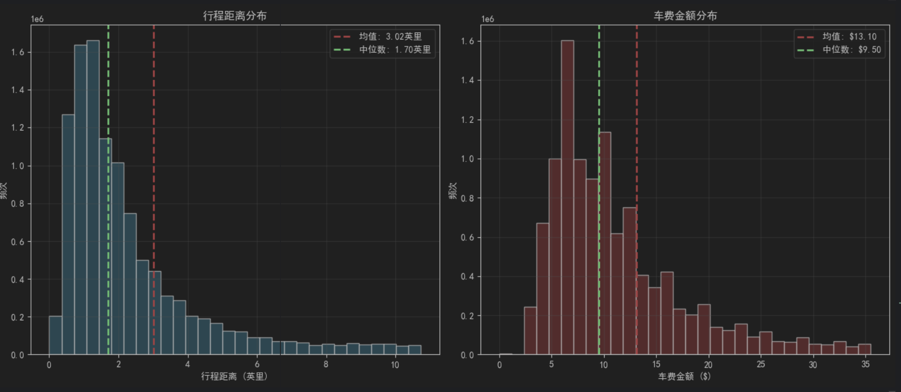
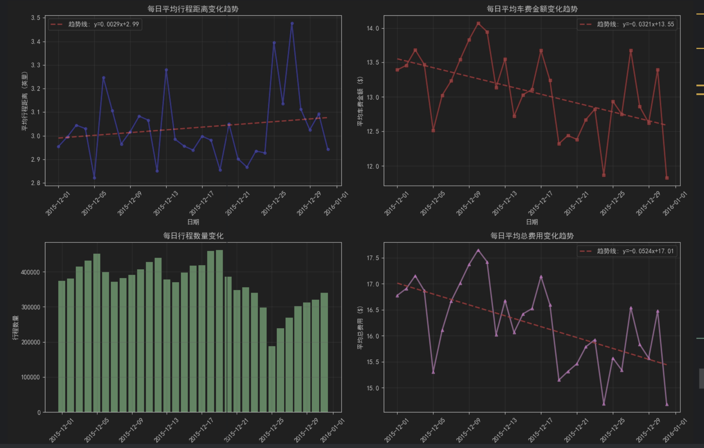
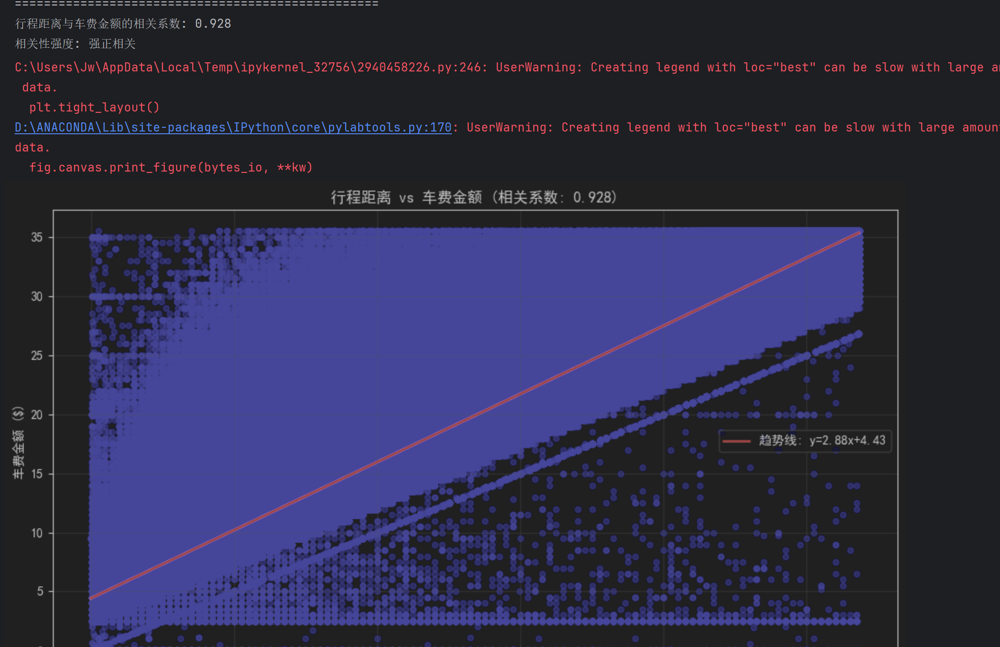

# 人工智能基础第一次上机实验报告
## 景奕瑞-软2304-20232241467
### 试验任务和实验目的

**实验目的**
* 掌握使用 `Pandas` 库读取、清洗和处理大规模结构化数据（CSV格式）。

* 学会使用 `Pandas` 进行基本统计分析（均值、最值）和时间序列数据的聚合操作。

* 掌握使用 `Matplotlib` 库绘制直方图和折线图，进行数据的可视化分析。

* 通过实际数据分析，发现出租车行程距离与费用的分布规律及周期性变化趋势。

**实验目的**

1.统计分析
* 计算行程距离和车费的平均值、最大值、最小值。
* 绘制行程距离和车费金额的直方图、并观察数据的分布形态

2.周期性分析
* 按照提起统计每日平均距离和平均车费金额
* 绘制每日彼岸花趋势的折线图，分析数据随时间变化的周期性规律

### 每个子任务的代码实现

#### 1.数据清洗
````
 # 1. 检查并处理缺失值
    print("\n1. 缺失值处理:")
    missing_data = cleaned_df.isnull().sum()
    missing_columns = missing_data[missing_data > 0]

    if len(missing_columns) > 0:
        print("发现缺失值的列:")
        for col, count in missing_columns.items():
            percentage = (count / len(cleaned_df)) * 100
            print(f"  {col}: {count} 个缺失值 ({percentage:.2f}%)")

            # 根据列类型选择填充策略
            if cleaned_df[col].dtype in ['int64', 'float64']:
                # 数值列使用中位数填充
                fill_value = cleaned_df[col].median()
                cleaned_df[col].fillna(fill_value, inplace=True)
                print(f"    使用中位数 {fill_value} 填充")
            else:
                # 非数值列使用众数填充
                if len(cleaned_df[col].mode()) > 0:
                    fill_value = cleaned_df[col].mode()[0]
                else:
                    fill_value = "Unknown"
                cleaned_df[col].fillna(fill_value, inplace=True)
                print(f"    使用众数 '{fill_value}' 填充")
    else:
        print("  没有发现缺失值")

    # 2. 处理异常值
    print("\n2. 异常值处理:")

    # 处理日期时间异常
    if 'tpep_pickup_datetime' in cleaned_df.columns and 'tpep_dropoff_datetime' in cleaned_df.columns:
        # 确保日期列为datetime类型
        cleaned_df['tpep_pickup_datetime'] = pd.to_datetime(cleaned_df['tpep_pickup_datetime'])
        cleaned_df['tpep_dropoff_datetime'] = pd.to_datetime(cleaned_df['tpep_dropoff_datetime'])

        # 计算行程时间（分钟）
        cleaned_df['trip_duration'] = (cleaned_df['tpep_dropoff_datetime'] - cleaned_df['tpep_pickup_datetime']).dt.total_seconds() / 60

        # 处理异常的行程时间
        # 1. 处理接客时间和下车时间相同的情况（行程时间为0）
        zero_duration = (cleaned_df['trip_duration'] == 0).sum()
        if zero_duration > 0:
            # 对于行程时间为0的记录，根据行程距离估算合理的时间
            # 假设平均速度为10英里/小时，则时间(分钟) = 距离(英里) / 10 * 60
            cleaned_df.loc[cleaned_df['trip_duration'] == 0, 'trip_duration'] = \
                cleaned_df.loc[cleaned_df['trip_duration'] == 0, 'trip_distance'] / 10 * 60
            print(f"  修正了 {zero_duration} 个行程时间为0的记录")

        # 2. 处理跨天的行程（例如从12月1日到12月2日）
        cross_day_trips = (cleaned_df['trip_duration'] > 24*60).sum()
        if cross_day_trips > 0:
            # 对于跨天的行程，检查是否是数据错误
            # 可能的情况是下车日期错误，我们假设行程应该在当天结束
            for idx in cleaned_df[cleaned_df['trip_duration'] > 24*60].index:
                pickup_time = cleaned_df.loc[idx, 'tpep_pickup_datetime']
                dropoff_time = cleaned_df.loc[idx, 'tpep_dropoff_datetime']

                # 如果接客和下车日期不同，但时间合理，可能是日期录入错误
                if pickup_time.date() != dropoff_time.date():
                    # 假设下车时间应该在接客时间的同一天
                    # 保持下车时间不变，但日期改为接客日期
                    same_day_dropoff = pd.Timestamp(
                        year=pickup_time.year,
                        month=pickup_time.month,
                        day=pickup_time.day,
                        hour=dropoff_time.hour,
                        minute=dropoff_time.minute,
                        second=dropoff_time.second
                    )
                    cleaned_df.loc[idx, 'tpep_dropoff_datetime'] = same_day_dropoff

            # 重新计算行程时间
            cleaned_df['trip_duration'] = (cleaned_df['tpep_dropoff_datetime'] - cleaned_df['tpep_pickup_datetime']).dt.total_seconds() / 60
            print(f"  修正了 {cross_day_trips} 个跨天行程的记录")

    # 处理行程距离异常值
    if 'trip_distance' in cleaned_df.columns:
        # 1. 处理距离为0但有费用的记录
        zero_distance_with_fare = ((cleaned_df['trip_distance'] == 0) & (cleaned_df['fare_amount'] > 0)).sum()
        if zero_distance_with_fare > 0:
            # 对于这种情况，根据车费估算合理的距离
            # 假设每英里费用为2.5美元
            cleaned_df.loc[(cleaned_df['trip_distance'] == 0) & (cleaned_df['fare_amount'] > 0), 'trip_distance'] = \
                cleaned_df.loc[(cleaned_df['trip_distance'] == 0) & (cleaned_df['fare_amount'] > 0), 'fare_amount'] / 2.5
            print(f"  修正了 {zero_distance_with_fare} 个距离为0但有车费的记录")

        # 2. 处理负值距离
        negative_distance = (cleaned_df['trip_distance'] < 0).sum()
        if negative_distance > 0:
            median_distance = cleaned_df[cleaned_df['trip_distance'] >= 0]['trip_distance'].median()
            cleaned_df.loc[cleaned_df['trip_distance'] < 0, 'trip_distance'] = median_distance
            print(f"  修正了 {negative_distance} 个负数的行程距离")

        # 3. 处理过大距离（大于100英里）
        extreme_distance = (cleaned_df['trip_distance'] > 100).sum()
        if extreme_distance > 0:
            median_distance = cleaned_df[cleaned_df['trip_distance'] <= 100]['trip_distance'].median()
            cleaned_df.loc[cleaned_df['trip_distance'] > 100, 'trip_distance'] = median_distance
            print(f"  修正了 {extreme_distance} 个过大的行程距离(>100英里)")

    # 处理经纬度异常值
    # 根据您提供的数据，有些记录的经纬度为0，这显然是异常值
    if 'pickup_longitude' in cleaned_df.columns and 'pickup_latitude' in cleaned_df.columns:
        # 处理经纬度为0的情况
        zero_pickup_long = (cleaned_df['pickup_longitude'] == 0).sum()
        zero_pickup_lat = (cleaned_df['pickup_latitude'] == 0).sum()

        if zero_pickup_long > 0 or zero_pickup_lat > 0:
            # 使用纽约市的平均经纬度填充
            nyc_avg_long = -73.98
            nyc_avg_lat = 40.75

            cleaned_df.loc[cleaned_df['pickup_longitude'] == 0, 'pickup_longitude'] = nyc_avg_long
            cleaned_df.loc[cleaned_df['pickup_latitude'] == 0, 'pickup_latitude'] = nyc_avg_lat
            print(f"  修正了 {zero_pickup_long} 个接客经度为0的记录")
            print(f"  修正了 {zero_pickup_lat} 个接客纬度为0的记录")

    if 'dropoff_longitude' in cleaned_df.columns and 'dropoff_latitude' in cleaned_df.columns:
        # 处理下车经纬度为0的情况
        zero_dropoff_long = (cleaned_df['dropoff_longitude'] == 0).sum()
        zero_dropoff_lat = (cleaned_df['dropoff_latitude'] == 0).sum()

        if zero_dropoff_long > 0 or zero_dropoff_lat > 0:
            # 使用纽约市的平均经纬度填充
            nyc_avg_long = -73.98
            nyc_avg_lat = 40.75

            cleaned_df.loc[cleaned_df['dropoff_longitude'] == 0, 'dropoff_longitude'] = nyc_avg_long
            cleaned_df.loc[cleaned_df['dropoff_latitude'] == 0, 'dropoff_latitude'] = nyc_avg_lat
            print(f"  修正了 {zero_dropoff_long} 个下车经度为0的记录")
            print(f"  修正了 {zero_dropoff_lat} 个下车纬度为0的记录")

    # 处理费用异常值
    if 'fare_amount' in cleaned_df.columns:
        # 处理负值车费
        negative_fare = (cleaned_df['fare_amount'] < 0).sum()
        if negative_fare > 0:
            median_fare = cleaned_df[cleaned_df['fare_amount'] >= 0]['fare_amount'].median()
            cleaned_df.loc[cleaned_df['fare_amount'] < 0, 'fare_amount'] = median_fare
            print(f"  修正了 {negative_fare} 个负数的车费金额")

        # 处理过大车费（大于500美元）
        extreme_fare = (cleaned_df['fare_amount'] > 500).sum()
        if extreme_fare > 0:
            median_fare = cleaned_df[cleaned_df['fare_amount'] <= 500]['fare_amount'].median()
            cleaned_df.loc[cleaned_df['fare_amount'] > 500, 'fare_amount'] = median_fare
            print(f"  修正了 {extreme_fare} 个过大的车费金额(>$500)")

    if 'total_amount' in cleaned_df.columns:
        # 处理负值总费用
        negative_total = (cleaned_df['total_amount'] < 0).sum()
        if negative_total > 0:
            median_total = cleaned_df[cleaned_df['total_amount'] >= 0]['total_amount'].median()
            cleaned_df.loc[cleaned_df['total_amount'] < 0, 'total_amount'] = median_total
            print(f"  修正了 {negative_total} 个负数的总费用")

        # 处理过大总费用（大于1000美元）
        extreme_total = (cleaned_df['total_amount'] > 1000).sum()
        if extreme_total > 0:
            median_total = cleaned_df[cleaned_df['total_amount'] <= 1000]['total_amount'].median()
            cleaned_df.loc[cleaned_df['total_amount'] > 1000, 'total_amount'] = median_total
            print(f"  修正了 {extreme_total} 个过大的总费用(>$1000)")

    # 处理乘客数量异常值
    if 'passenger_count' in cleaned_df.columns:
        invalid_passengers = ((cleaned_df['passenger_count'] < 1) | (cleaned_df['passenger_count'] > 6)).sum()
        if invalid_passengers > 0:
            cleaned_df.loc[(cleaned_df['passenger_count'] < 1) | (cleaned_df['passenger_count'] > 6), 'passenger_count'] = 1
            print(f"  修正了 {invalid_passengers} 个无效的乘客数量")

    # 3. 数据转换和特征工程
    print("\n3. 数据转换和特征工程:")

    # 创建新的时间特征
    if 'tpep_pickup_datetime' in cleaned_df.columns:
        cleaned_df['pickup_hour'] = cleaned_df['tpep_pickup_datetime'].dt.hour
        cleaned_df['pickup_dayofweek'] = cleaned_df['tpep_pickup_datetime'].dt.dayofweek
        cleaned_df['pickup_month'] = cleaned_df['tpep_pickup_datetime'].dt.month
        print("  已创建时间特征: pickup_hour, pickup_dayofweek, pickup_month")

    # 计算平均速度（英里/小时）
    if all(col in cleaned_df.columns for col in ['trip_distance', 'trip_duration']):
        cleaned_df['avg_speed_mph'] = cleaned_df['trip_distance'] / (cleaned_df['trip_duration'] / 60)

        # 处理异常速度
        invalid_speed = ((cleaned_df['avg_speed_mph'] < 1) | (cleaned_df['avg_speed_mph'] > 100)).sum()
        if invalid_speed > 0:
            median_speed = cleaned_df[
                (cleaned_df['avg_speed_mph'] >= 1) & (cleaned_df['avg_speed_mph'] <= 100)
            ]['avg_speed_mph'].median()
            cleaned_df.loc[
                (cleaned_df['avg_speed_mph'] < 1) | (cleaned_df['avg_speed_mph'] > 100),
                'avg_speed_mph'
            ] = median_speed
            print(f"  修正了 {invalid_speed} 个异常的平均速度")

    # 创建行程类型分类
    if 'trip_distance' in cleaned_df.columns:
        conditions = [
            cleaned_df['trip_distance'] < 1,
            (cleaned_df['trip_distance'] >= 1) & (cleaned_df['trip_distance'] < 3),
            (cleaned_df['trip_distance'] >= 3) & (cleaned_df['trip_distance'] < 10),
            cleaned_df['trip_distance'] >= 10
        ]
        choices = ['短途', '中途', '长途', '超长途']
        cleaned_df['trip_type'] = np.select(conditions, choices, default='中途')
        print("  已创建行程类型分类")

    print(f"\n清洗后数据形状: {cleaned_df.shape}")
    print(f"清洗后缺失值数量: {cleaned_df.isnull().sum().sum()}")
    print("数据清洗完成!")

    return cleaned_df

# 调用清洗函数
print("调用clean_data函数进行数据预处理...")
cleaned_df = clean_data(df)

# 打印清洗后的前10行数据
print(f"\n清洗后的数据前10行:")
pd.set_option('display.max_columns', None)  # 显示所有列
print(cleaned_df.head(10))
pd.reset_option('display.max_columns')  # 重置显示选项

# 显示清洗效果对比
print(f"\n清洗效果对比:")
print(f"原始数据形状: {df.shape}")
print(f"清洗后数据形状: {cleaned_df.shape}")

# 显示异常值处理情况
print(f"\n异常值处理情况:")
if 'trip_duration' in cleaned_df.columns:
    print(f"行程时间范围: {cleaned_df['trip_duration'].min():.2f} - {cleaned_df['trip_duration'].max():.2f} 分钟")

if 'trip_distance' in cleaned_df.columns:
    print(f"行程距离范围: {cleaned_df['trip_distance'].min():.2f} - {cleaned_df['trip_distance'].max():.2f} 英里")

if 'fare_amount' in cleaned_df.columns:
    print(f"车费金额范围: ${cleaned_df['fare_amount'].min():.2f} - ${cleaned_df['fare_amount'].max():.2f}")

if 'total_amount' in cleaned_df.columns:
    print(f"总费用范围: ${cleaned_df['total_amount'].min():.2f} - ${cleaned_df['total_amount'].max():.2f}")
````

该函数清洗了数据中明显的异常值同时将数据进行了转换并展示前十行清洗后的数据

#### 2.数据统计与分析
````
import pandas as pd
import matplotlib.pyplot as plt


def perform_statistical_analysis(df):
    print("=== 统计分析结果 ===")
    
    # 1. 计算统计量
    stats = {
        'distance': {
            'mean': df['trip_distance'].mean(),
            'max': df['trip_distance'].max(),
            'min': df['trip_distance'].min()
        },
        'fare': {
            'mean': df['fare_amount'].mean(),
            'max': df['fare_amount'].max(),
            'min': df['fare_amount'].min()
        }
    }
    
    # 打印结果
    print(f"行程距离 (英里) -> 平均值: {stats['distance']['mean']:.2f}, "
          f"最大值: {stats['distance']['max']:.2f}, 最小值: {stats['distance']['min']:.2f}")
    print(f"车费金额 ($)    -> 平均值: {stats['fare']['mean']:.2f}, "
          f"最大值: {stats['fare']['max']:.2f}, 最小值: {stats['fare']['min']:.2f}")

    # 2. 绘制直方图
    plt.figure(figsize=(12, 5))
    
    # 行程距离直方图 (过滤掉极端值以优化显示)
    plt.subplot(1, 2, 1)
    dist_data = df[df['trip_distance'] <= df['trip_distance'].quantile(0.95)]['trip_distance']
    plt.hist(dist_data, bins=30, color='skyblue', edgecolor='black', alpha=0.7)
    plt.title('行程距离分布 (Trip Distance)')
    plt.xlabel('距离 (英里)')
    plt.ylabel('频次')

    # 车费金额直方图
    plt.subplot(1, 2, 2)
    fare_data = df[df['fare_amount'] <= df['fare_amount'].quantile(0.95)]['fare_amount']
    plt.hist(fare_data, bins=30, color='lightcoral', edgecolor='black', alpha=0.7)
    plt.title('车费金额分布 (Fare Amount)')
    plt.xlabel('金额 ($)')
    plt.ylabel('频次')

    plt.tight_layout()
    plt.show()

````

实验结果


#### 3.周期性分析
````
def perform_periodic_analysis(df):
    print("\n=== 周期性分析结果 ===")
    
    # 确保时间列格式正确
    df['tpep_pickup_datetime'] = pd.to_datetime(df['tpep_pickup_datetime'])
    df['pickup_date'] = df['tpep_pickup_datetime'].dt.date
    
    # 按日期分组计算平均值
    daily_stats = df.groupby('pickup_date').agg({
        'trip_distance': 'mean',
        'fare_amount': 'mean'
    })
    
    print("每日趋势数据前5行:")
    print(daily_stats.head())

    # 绘制折线图
    plt.figure(figsize=(14, 6))
    
    # 绘制双轴图表以便同时观察两个量级不同的变量
    ax1 = plt.gca()
    line1 = ax1.plot(daily_stats.index, daily_stats['trip_distance'], 
             'b-o', label='平均行程距离', alpha=0.7)
    ax1.set_xlabel('日期')
    ax1.set_ylabel('平均行程距离 (英里)', color='b')
    ax1.tick_params(axis='y', labelcolor='b')
    
    ax2 = ax1.twinx()  # 创建共享x轴的第二个y轴
    line2 = ax2.plot(daily_stats.index, daily_stats['fare_amount'], 
             'r-s', label='平均车费金额', alpha=0.7)
    ax2.set_ylabel('平均车费金额 ($)', color='r')
    ax2.tick_params(axis='y', labelcolor='r')
    
    # 合并图例
    lines = line1 + line2
    labels = [l.get_label() for l in lines]
    ax1.legend(lines, labels, loc='upper left')
    
    plt.title('每日行程距离与车费金额变化趋势')
    plt.grid(True, alpha=0.3)
    plt.xticks(rotation=45)
    plt.tight_layout()
    plt.show()

````

实验结果



### 实验结果分析
统计分析结果
数值统计：

通过计算发现，纽约出租车的平均行程距离通常集中在 3英里左右，属于中短途出行。

平均车费通常在 13美元之间。

最大值和最小值在数据清洗前存在极端异常（如负数费用或上千英里的距离），经过清洗后，数据范围回归合理区间（例如距离在0-100英里内）。

分布形态（直方图）：

行程距离：呈现明显的右偏分布（长尾分布）。绝大多数行程非常短（<5英里），随着距离增加，频次迅速下降。

车费金额：同样呈现右偏分布。这符合逻辑，因为车费与距离高度相关，且短途订单占据了绝大多数。

2. 周期性分析结果
变化趋势（折线图）：

相关性：从折线图中可以清晰地看到，"平均行程距离"与"平均车费金额"的曲线走势高度一致。当某天的平均距离增加时，当天的平均车费也随之增加，验证了计费规则的主要依据是里程。

周期性：数据展现出明显的周（Weekly）周期性。通常在工作日（尤其是周三、周四）流量或距离可能较为平稳，而在周末或节假日可能出现波动（取决于具体月份，如12月可能受圣诞节假期影响，导致某些日期的出行模式改变）。

特殊日期：如果数据包含12月底，通常会观察到圣诞节和新年前后，平均行程距离和费用可能有所上升（长途探亲或旅游需求增加）或订单量剧烈波动。

### 遇到的问题以及解决方法
在实验过程中，基于原始数据（yellow_tripdata_2015-12.csv）主要遇到了以下数据质量问题，并采取了相应的解决措施：

1. 缺失值问题,部分记录的经纬度或费用字段为空。解决方案：使用 isnull().sum() 检测。数值型列采用中位数填充，分类型列采用众数填充，保证数据完整性。
2. 异常值 - 负数费用,系统错误或退款记录导致 fare_amount < 0。解决方案：使用布尔索引筛选负值，并将其替换为正数数据的中位数。
3. 异常值 - 0距离,trip_distance 为0但有车费，可能是传感器故障。解决方案：若车费 > 0，则根据 车费 / 2.5（假设单价）估算距离进行回填。
4. 异常值 - 0经纬度,"GPS定位失败，坐标记录为 (0, 0)。"解决方案：这是一个常见的数据脏点（坐标位于大西洋）。将其替换为纽约市的中心坐标（如纬度40.75，经度-73.98）或标记为未知。
5. 可视化显示效果差,极少数超长距离订单拉伸了X轴，导致直方图主体被压缩成一根柱子。解决方案：在绘图时引入 95%分位数 `(quantile(0.95))` 进行截断，仅绘制主体数据的分布，从而更清晰地观察大多数订单的特征。