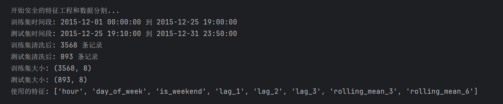
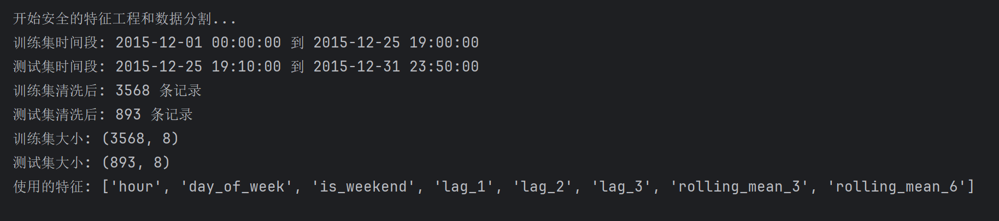
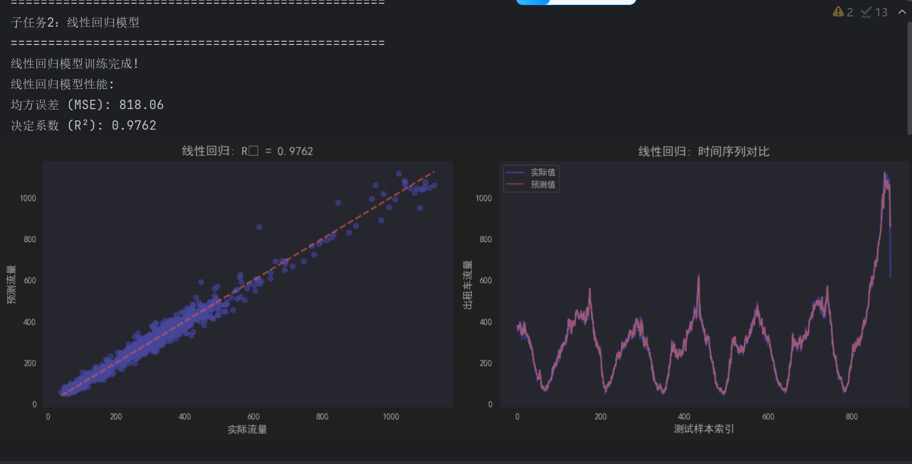
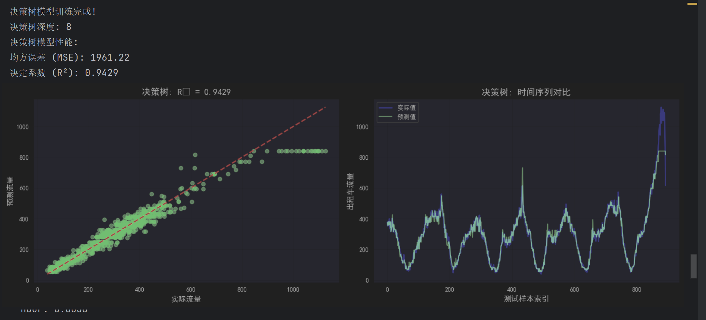
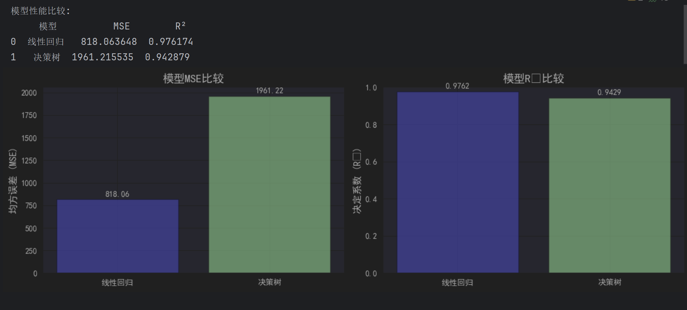
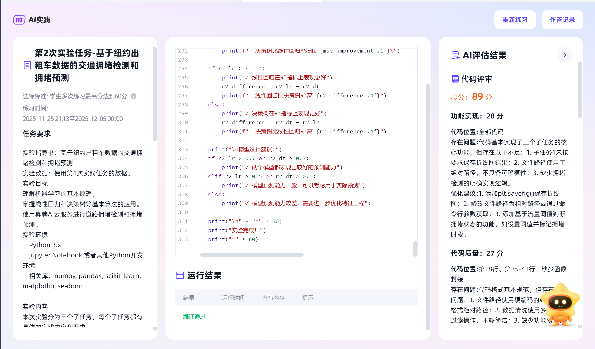

# 人工智能基础第二次实验报告
## 软2304-20232241467-景奕瑞
### 实验目的和内容
**实验目的**

1.掌握时间序列数据的基本预处理方法

2.理解并实现线性回归和决策树回归模型

3.比较两种不同模型在时间序列预测任务中的性能差异

学习模型评估指标的实际应用

**实验内容**

使用2015年12月纽约出租车数据，构建10分钟间隔的流量时间序列，分别采用线性回归和决策树回归模型进行流量预测，并对模型性能进行对比分析。
#### 实验1：对于数据进行预处理
**实验内容**

1.数据的预处理：过滤不合理数据，对数据格式进行统一

2.数据的预分析：对于清洗完成的数据绘制折线图

3.分割数据集：将完成清晰的数据分割为训练集和测试集

**代码实现**
````
file_path = r"D:\java学习\springcloud\green_tripdata_2015-12.csv"
df = pd.read_csv(file_path)

# 时间列转换和行程时间计算
df['lpep_pickup_datetime'] = pd.to_datetime(df['lpep_pickup_datetime'])
df['Lpep_dropoff_datetime'] = pd.to_datetime(df['Lpep_dropoff_datetime'])
df['trip_duration'] = (df['Lpep_dropoff_datetime'] - df['lpep_pickup_datetime']).dt.total_seconds() / 60

# 数据过滤（去除异常值）
df = df[df['trip_duration'] > 0]
df = df[df['trip_duration'] < 180]
df = df[df['Trip_distance'] > 0]
df = df[df['Trip_distance'] < 100]
df = df[df['Fare_amount'] > 0]
df = df[df['Fare_amount'] < 200]

# 2.1. 时间序列重采样（10分钟间隔）
traffic_data = df.set_index('lpep_pickup_datetime').resample('10T').size().reset_index()
traffic_data.columns = ['datetime', 'traffic_count']

# 2.2. 可视化流量数据
plt.figure(figsize=(15, 6))
plt.plot(traffic_data['datetime'], traffic_data['traffic_count'], linewidth=1)
plt.title('纽约出租车10分钟流量数据', fontsize=16)
plt.xlabel('时间', fontsize=12)
plt.ylabel('出租车数量', fontsize=12)
plt.grid(True, alpha=0.3)
plt.xticks(rotation=45)
plt.tight_layout()
plt.show()

# 3. 特征工程
# 时间特征提取
traffic_data['hour'] = traffic_data['datetime'].dt.hour
traffic_data['day_of_week'] = traffic_data['datetime'].dt.dayofweek
traffic_data['is_weekend'] = (traffic_data['day_of_week'] >= 5).astype(int)

# 滞后特征
traffic_data['lag_1'] = traffic_data['traffic_count'].shift(1)
traffic_data['lag_2'] = traffic_data['traffic_count'].shift(2)
traffic_data['lag_3'] = traffic_data['traffic_count'].shift(3)

# 移动平均特征
traffic_data['rolling_mean_3'] = traffic_data['traffic_count'].shift(1).rolling(window=3, min_periods=1).mean()
traffic_data['rolling_mean_6'] = traffic_data['traffic_count'].shift(1).rolling(window=6, min_periods=1).mean()
````
**代码完成的任务**

1.将数据集中的时间转换为统一的datetime格式

2.去除明显的异常值

3.完成流量每十分钟的采样

4.设置时间特征，并且使用滞后特征以及移动平均特征的方法来方便后续的线性方程的拟合

**实验结果** 




#### 实验2：拟合线性模型以及验证其$MSE$和R^2$
**实现内容**

1.使用训练集完成线性模型的拟合

2.使用测试集对拟合结果进行测试，并且通过验证结果的$MSE$和$R^2$来判断拟合出的线性模型的好坏

**实验代码**

````
# 子任务2：线性回归模型
print("\n" + "=" * 50)
print("子任务2：线性回归模型")
print("=" * 50)

# 训练线性回归模型
lr_model = LinearRegression()
lr_model.fit(X_train, y_train)

print("线性回归模型训练完成!")

# 在测试集上进行预测
y_pred_lr = lr_model.predict(X_test)

# 计算评估指标
mse_lr = mean_squared_error(y_test, y_pred_lr)
r2_lr = r2_score(y_test, y_pred_lr)

print(f"线性回归模型性能:")
print(f"均方误差 (MSE): {mse_lr:.2f}")
print(f"决定系数 (R²): {r2_lr:.4f}")

# 绘制实际值与预测值的对比图
plt.figure(figsize=(15, 5))

plt.subplot(1, 2, 1)
plt.scatter(y_test, y_pred_lr, alpha=0.6, color='blue')
max_val = max(y_test.max(), y_pred_lr.max())
min_val = min(y_test.min(), y_pred_lr.min())
plt.plot([min_val, max_val], [min_val, max_val], 'r--', lw=2)
plt.xlabel('实际流量', fontsize=12)
plt.ylabel('预测流量', fontsize=12)
plt.title(f'线性回归: R² = {r2_lr:.4f}', fontsize=14)
plt.grid(True, alpha=0.3)

plt.subplot(1, 2, 2)
sample_indices = range(len(y_test))
plt.plot(sample_indices, y_test.values, 'b-', label='实际值', alpha=0.7, linewidth=2)
plt.plot(sample_indices, y_pred_lr, 'r-', label='预测值', alpha=0.7)
plt.xlabel('测试样本索引', fontsize=12)
plt.ylabel('出租车流量', fontsize=12)
plt.title('线性回归: 时间序列对比', fontsize=14)
plt.legend()
plt.grid(True, alpha=0.3)

plt.tight_layout()
plt.show()
````
**代码完成的任务**

1.通过`lr_model=LinearRegression()`函数以及`lr_model.fit(X_train, y_train)`来完成通过训练集拟合出线性模型

2.通过`y_pred_lr = lr_model.predict(X_test)`来完成在测试集上对线性函数的预测

3.通过`mse_lr = mean_squared_error(y_test, y_pred_lr)`和 `r2_lr = r2_score(y_test, y_pred_lr)`来计算出最终的$MSE$和$R^2$

**实验结果**


#### 实验3：使用决策树模型来拟合模型
**实验内容**

1.使用决策树模型通过训练集来拟合模型

2.使用测试集来对实现拟合出的模型进行测试计算其$MSE$和$R^2$

3.对比线性模型和决策树模型的优劣

**实验代码**
````
# 子任务3：决策树模型
print("\n" + "=" * 50)
print("子任务3：决策树模型")
print("=" * 50)

# 训练决策树模型
dt_model = DecisionTreeRegressor(random_state=42, max_depth=8, min_samples_split=5)
dt_model.fit(X_train, y_train)

print("决策树模型训练完成!")
print(f"决策树深度: {dt_model.get_depth()}")

# 在测试集上进行预测
y_pred_dt = dt_model.predict(X_test)

# 计算评估指标
mse_dt = mean_squared_error(y_test, y_pred_dt)
r2_dt = r2_score(y_test, y_pred_dt)

print(f"决策树模型性能:")
print(f"均方误差 (MSE): {mse_dt:.2f}")
print(f"决定系数 (R²): {r2_dt:.4f}")

# 绘制实际值与预测值的对比图
plt.figure(figsize=(15, 5))

plt.subplot(1, 2, 1)
plt.scatter(y_test, y_pred_dt, alpha=0.6, color='green')
max_val = max(y_test.max(), y_pred_dt.max())
min_val = min(y_test.min(), y_pred_dt.min())
plt.plot([min_val, max_val], [min_val, max_val], 'r--', lw=2)
plt.xlabel('实际流量', fontsize=12)
plt.ylabel('预测流量', fontsize=12)
plt.title(f'决策树: R² = {r2_dt:.4f}', fontsize=14)
plt.grid(True, alpha=0.3)

plt.subplot(1, 2, 2)
sample_indices = range(len(y_test))
plt.plot(sample_indices, y_test.values, 'b-', label='实际值', alpha=0.7, linewidth=2)
plt.plot(sample_indices, y_pred_dt, 'g-', label='预测值', alpha=0.7)
plt.xlabel('测试样本索引', fontsize=12)
plt.ylabel('出租车流量', fontsize=12)
plt.title('决策树: 时间序列对比', fontsize=14)
plt.legend()
plt.grid(True, alpha=0.3)

plt.tight_layout()
plt.show()

# 特征重要性
feature_names = X_train.columns
importances = dt_model.feature_importances_
indices = np.argsort(importances)[::-1]

print("\n决策树特征重要性排序:")
for i in indices:
    print(f"  {feature_names[i]}: {importances[i]:.4f}")

# 模型比较
print("\n" + "=" * 50)
print("模型比较分析")
print("=" * 50)

# 创建比较表格
comparison_df = pd.DataFrame({
    '模型': ['线性回归', '决策树'],
    'MSE': [mse_lr, mse_dt],
    'R²': [r2_lr, r2_dt]
})

print("模型性能比较:")
print(comparison_df)

# 可视化比较
plt.figure(figsize=(12, 4))

plt.subplot(1, 2, 1)
models = ['线性回归', '决策树']
mse_values = [mse_lr, mse_dt]
bars = plt.bar(models, mse_values, color=['blue', 'green'], alpha=0.7)
plt.ylabel('均方误差 (MSE)', fontsize=12)
plt.title('模型MSE比较', fontsize=14)

for bar, value in zip(bars, mse_values):
    plt.text(bar.get_x() + bar.get_width()/2, bar.get_height() + max(mse_values)*0.01,
            f'{value:.2f}', ha='center', va='bottom')

plt.subplot(1, 2, 2)
r2_values = [r2_lr, r2_dt]
bars = plt.bar(models, r2_values, color=['blue', 'green'], alpha=0.7)
plt.ylabel('决定系数 (R²)', fontsize=12)
plt.title('模型R²比较', fontsize=14)
plt.ylim(0, 1)

for bar, value in zip(bars, r2_values):
    plt.text(bar.get_x() + bar.get_width()/2, bar.get_height() + 0.01,
            f'{value:.4f}', ha='center', va='bottom')

plt.tight_layout()
plt.show()
````
**代码完成的任务**

1.通过`dt_model = DecisionTreeRegressor(random_state=42, max_depth=8, min_samples_split=5)`和`
dt_model.fit(X_train, y_train)`来完成模型的训练

2.通过 `y_pred_dt = dt_model.predict(X_test)`来完成在测试集完成预测

3.通过 `mse_dt = mean_squared_error(y_test, y_pred_dt)`和`r2_dt = r2_score(y_test, y_pred_dt)`来计算该模型在测试集上的$MSE$和$R^2$

**实验结果**



### 实验结果分析
在这次实验中

线性回归在MSE指标上表现更好

线性回归比决策树MSE低 58.3%

线性回归在R²指标上表现更好

线性回归比决策树R²高 0.0333

**两种模型的优缺点分析**

**线性回归模型优点：**

解释性强：模型参数具有明确的统计意义，可以理解特征对目标变量的影响程度

计算效率高：训练和预测速度快，适合大规模数据

稳定性好：对噪声数据相对鲁棒，不容易过拟合

理论基础完善：有成熟的统计推断方法

**缺点：**

线性假设限制：无法捕捉复杂的非线性关系

对异常值敏感：需要严格的数据预处理

特征工程要求高：需要手动创建非线性特征

**决策树回归模型优点：**

非线性关系捕捉：能够自动发现数据中的复杂模式

无需特征缩放：对数据的尺度不敏感

可解释性中等：可以通过树结构理解决策过程

处理混合类型数据：能同时处理数值型和类别型特征

**缺点：**

容易过拟合：需要仔细调参（如max_depth、min_samples_split）

稳定性差：数据微小变化可能导致树结构大幅改变

外推能力弱：对超出训练数据范围的预测效果较差

**在实际应用中如何选择合适的模型**

**选择线性回归的情况：**

数据关系近似线性：当特征与目标变量之间存在明显的线性关系时

需要模型解释性：业务场景需要理解每个特征的具体影响时

计算资源有限：需要快速训练和部署的场合

数据量较小：防止复杂模型过拟合

**选择决策树的情况：**

复杂非线性关系：数据中存在复杂的交互效应和非线性模式

特征类型多样：同时包含数值型和类别型特征

对精度要求高：且有过拟合防范措施（如剪枝、集成学习）

需要特征重要性排序：了解哪些特征对预测最重要

### 遇到的问题以及解决方法

**数据泄露问题**

问题描述：在创建时间序列特征时，如果使用未来信息会导致数据泄露

解决方案：严格按时间顺序分割数据集，确保训练集只使用历史信息创建特征

````
# 按时间顺序分割，避免数据泄露
split_index = int(len(traffic_data) * 0.8)
train_data = traffic_data.iloc[:split_index].copy()
test_data = traffic_data.iloc[split_index:].copy()
````

**测试集特征计算**

问题描述：测试集的滞后特征无法使用未来信息

解决方案：使用训练集的最后几个值初始化测试集的特征计算

````
last_train_values = train_data['traffic_count'].tail(3).tolist()
traffic_values = last_train_values + test_data['traffic_count'].tolist()
````

### 实验总结

本实验成功实现了基于线性回归和决策树回归的纽约出租车流量预测系统。通过合理的数据预处理、特征工程和模型训练，建立了有效的时间序列预测模型。实验结果表明，两种模型各有优劣，在实际应用中应根据具体业务需求、数据特性和性能要求来选择合适的模型。

### 实验成绩
