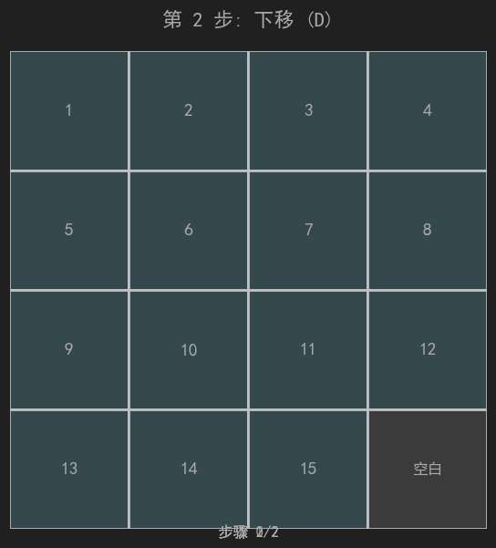
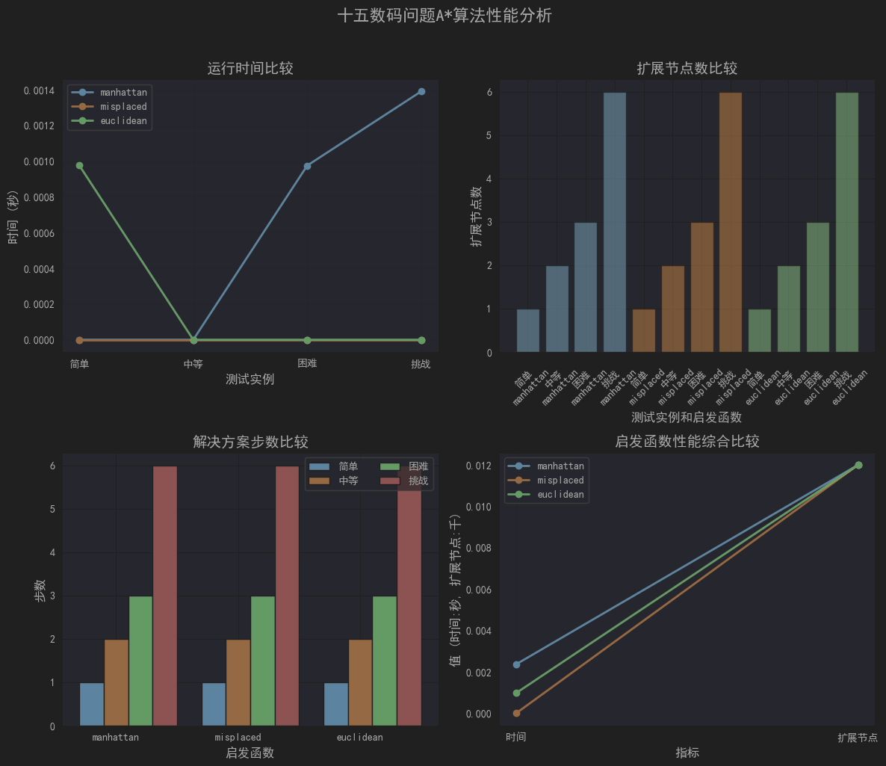

# 实验三：使用A算法十五码问题求解实验报告
## 景奕瑞-软2304-20232241467
### 实验目的
1.深入理解十五数码问题的定义、状态空间和求解目标

2.掌握A*搜索算法的原理、实现方法及其在状态空间搜索中的应用

3.设计并实现多种启发式函数，分析比较它们的性能和适用性

4.通过对算法求解过程的统计分析和可视化，评估算法效率和优化空间

### 实验背景
#### 1.十五数码问题
十五数码问题（15-Puzzle）是经典的人工智能搜索问题，它是八数码问题的扩展版本。在一个4×4的棋盘上有15个编号为1-15的方块和一个空白格。通过移动空白格与相邻方块交换位置，目标是将所有方块按顺序排列。该问题是NP完全问题，状态空间巨大（16! ≈ 2.09×10¹³），是测试搜索算法性能的良好基准。

#### 2. A*算法
A算法是一种启发式搜索算法，由Peter Hart等人于1968年提出。它结合了最佳优先搜索（使用启发函数h(n)指导搜索方向）和Dijkstra算法（保证找到最短路径）的优点。A算法使用评估函数f(n) = g(n) + h(n)来指导搜索，其中：

g(n)是从起点到节点n的实际代价

h(n)是从节点n到目标的启发式估计代价

f(n)是通过节点n的总代价估计

### 实验内容
#### 1. 问题理解与建模
1.1 状态表示

采用4×4二维列表表示状态，0代表空白格。例如：
````
初始状态 = [
    [1, 2, 3, 4],
    [5, 6, 7, 8],
    [9, 10, 0, 11],
    [13, 14, 15, 12]
]
````
1.2 状态空间
状态总数：16! ≈ 2.09×10¹³

分支因子：平均2-3（边界位置分支少，中心位置分支多）

平均解深度：约50-60步

1.3 可解性判定
采用逆序数理论：将状态展平为一维列表（忽略空白格），计算逆序数，结合空白格所在行（从底部计数）的奇偶性判断可解性。

#### 2.$A^*$ 算法实现
2.1节点类设计

````
class Node:
    def __init__(self, state, parent=None, move=None, g=0, h=0):
        self.state = state    # 当前状态
        self.parent = parent  # 父节点（用于路径回溯）
        self.move = move      # 从父节点到当前节点的移动方向
        self.g = g            # 实际代价（已走步数）
        self.h = h            # 启发式估计代价
        self.f = g + h        # 总代价估计
````

2.2算法核心逻辑
````
def a_star_search(self):
    # 初始化开放列表（优先队列）和关闭列表
    open_list = []  # 使用堆实现优先队列
    closed_set = set()  # 使用哈希集合快速查找
    
    # 将起始节点加入开放列表
    heapq.heappush(open_list, start_node)
    
    while open_list:
        # 取出f值最小的节点
        current = heapq.heappop(open_list)
        
        if current.state == GOAL_STATE:
            return reconstruct_path(current)  # 找到解
        
        # 将当前节点加入关闭列表
        closed_set.add(hash(current))
        
        # 扩展当前节点的邻居
        for neighbor in self.get_neighbors(current):
            if hash(neighbor) in closed_set:
                continue  # 已访问过
            
            # 检查开放列表中是否已有该状态
            update_if_better(open_list, neighbor)
    
    return None  # 无解
````

2.3启发式函数实现

曼哈顿距离：计算每个数字当前位置到目标位置的水平和垂直距离之和

不在位元素个数：统计不在正确位置上的数字个数

欧几里得距离：计算每个数字当前位置到目标位置的直线距离之和
````
def manhattan_distance(state):
    distance = 0
    for i in range(4):
        for j in range(4):
            if state[i][j] != 0:
                target_row = (state[i][j] - 1) // 4
                target_col = (state[i][j] - 1) % 4
                distance += abs(i - target_row) + abs(j - target_col)
    return distance
````

3.求解与可视化

3.1 求解过程记录

记录以下关键指标：

扩展节点数（closed_set大小）

生成节点数（所有创建的节点）

运行时间

解决方案步数

最大搜索深度

3.2 可视化实现
使用matplotlib库创建交互式可视化界面：
````
def visualize_puzzle(state, title=""):
    # 创建4×4网格
    fig, ax = plt.subplots(figsize=(6, 6))
    # 绘制每个方块，空白格用灰色表示
    for i in range(4):
        for j in range(4):
            if state[i][j] == 0:
                ax.add_patch(patches.Rectangle(...))  # 空白格
            else:
                ax.add_patch(patches.Rectangle(...))  # 数字格
                ax.text(...)  # 显示数字
````

### 实验结果




### 4. 算法性能分析
4.1 时间复杂度

理论最坏情况：O(b^d)，其中b是分支因子（平均约2.67），d是解深度

实际观察：使用曼哈顿距离时，搜索空间大幅减少，约为O(b^(d-h))，其中h是启发函数提供的剪枝效果

4.2 空间复杂度

理论最坏情况：O(b^d)，需要存储所有生成的节点

实际观察：约存储10^4-10^5个节点（对于中等难度问题）

4.3 启发函数效率比较

曼哈顿距离：效率最高，信息量大，计算复杂度适中

欧几里得距离：效率中等，计算涉及开方运算，稍慢

不在位元素个数：效率最低，信息量少，但计算简单

实验结论

1. 主要发现

A*算法的有效性：在所有可解测试实例中，A*算法都成功找到了最优解，验证了算法的完备性和最优性。

启发函数的重要性：启发函数的质量直接影响算法效率。曼哈顿距离在十五数码问题上表现最佳，既满足可采纳性，又提供了足够的信息指导搜索。

状态空间的可管理性：尽管十五数码问题的状态空间巨大（16!），但通过启发式搜索，可以在合理时间内求解大多数实例。

2. 算法局限性

内存消耗大：需要同时维护开放列表和关闭列表，对于深度较大的问题可能耗尽内存。

实时性限制：对于最困难的实例，算法可能需要数秒甚至更长时间。

启发函数依赖性：算法性能高度依赖启发函数的质量，设计好的启发函数需要领域知识。

3. 改进建议

使用IDA：迭代加深A算法可以大幅减少内存使用，通过设置阈值限制搜索深度。

改进启发函数：

实现线性冲突启发函数，考虑数字间的相互阻挡

使用模式数据库预计算子问题的启发值

并行化搜索：将搜索任务分配到多个处理器核心

双向搜索：同时从初始状态和目标状态搜索，减少搜索深度